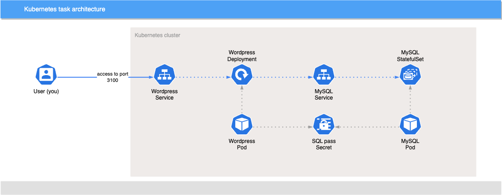

# Kubernetes task

With this task you will write manifests to build the following architecture:

## Setup

> If you already have `kubectl` and cluster setup - you can skip this

There are several ways to get a free Kubernetes cluster for running the exercise.

You can set up a local cluster with [Docker Desktop](https://docs.docker.com/desktop/) or [Kind](https://kind.sigs.k8s.io/).

Before you are able to do anything on the cluster, you need to be able to *talk* to this cluster using your computer. [kubectl](https://kubernetes.io/docs/tasks/tools/#kubectl) is *the* command line tool to talk to a Kubernetes cluster. To get that on your computer follow the instructions for `kubectl` on this page: <https://kubernetes.io/docs/tasks/tools/#kubectl>

## Task

1. Apply the `01-sql-secret.yaml` manifest using `kubectl`. The manifest contains a Secret with a password that is used for MySQL access.
2. Apply the `02-mysql.yaml` manifest using `kubectl`. The manifest contains a StatefulSet and a Service to run MySQL 8. It references the previous Secret to setup the password.
3. Write a Deployment manifest in `task-01-deployment.yaml`. The Deployment must:
    * Have `selector` in `spec` set to match labels `app: wordpress`
    * Have `labels` in `template.metadata` set to `app: wordpress`
    * Have **1** container
        * It must have the `wordpress` Docker image set.
        * It must have `wordpress` name.
        * Have **2** environment variable set:
            * `WORDPRESS_DB_HOST` with a value of `mysql`.
            * `WORDPRESS_DB_PASSWORD` with a value taken from `password` key in the `sql-pass` secret.
        * `containerPort` must be set to `80`
4. Write a Service manifest in `task-02-service.yaml`. The Service must:
    * Have `NodePort` type
    * Have ports specification to have `port` set to `80`, `targetPort` set to `80` and `nodePort` set to `31000`
    * Have `selector` to match your Wordpress pod labels (`app: wordpress`).
5. Apply `task-01-deployment.yaml` and `task-02-service.yaml` manifests using `kubectl`.
6. Access your application, in most local clusters it should be `http://localhost:31000`. You should see Wordpress setup screen.